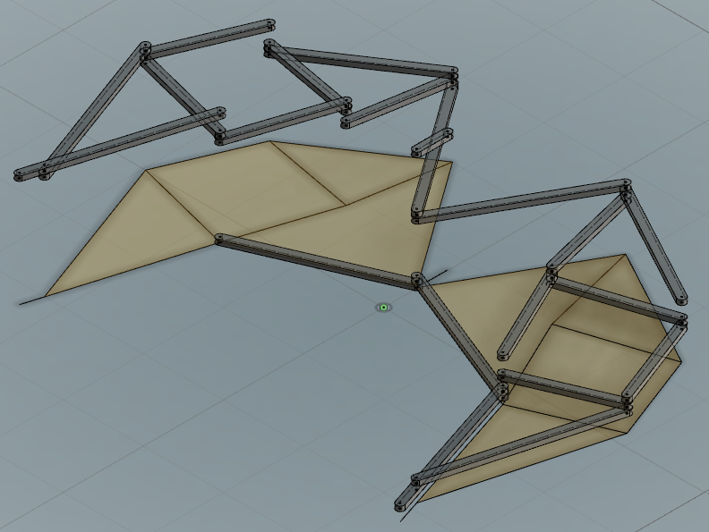
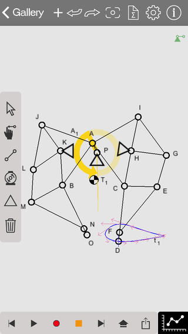
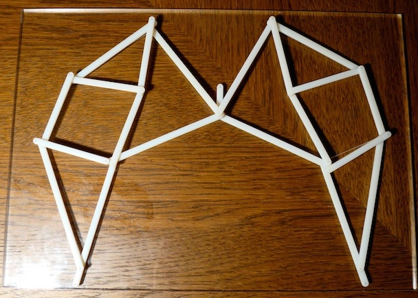

#  ForceEffect Import for Fusion 360

## Installation

Copy the "Fusion360ForceEffectImport" folder into your Fusion 360 "My Scripts" folder. You may find this folder using the following steps:

1. Start Fusion 360 and then select the File -> "Scripts and Add-Ins..." menu item
2. The Scripts and Add-Ins dialog will appear and display the "My Scripts" and "Sample Scripts" folders
3. Select one of the "My Scripts" files and then click on the "+" Details icon near the bottom of the dialog.
  - If there are no files in the "My Scripts" folder then create a default one by clicking the Create button, select JavaScript, and then OK.
4. With a user script selected and the "Details" section expanded, look at the Full Path value.  This contains the location of the user scripts folder.
5. Copy this script's folder into that location.
  For example, on my Mac the folder is located in:
    /Users/USERNAME/Library/Application Support/Autodesk/Autodesk Fusion 360/API/Scripts
  And on Windows:
    C:\users\USERNAME\AppData\Roaming\Autodesk\Autodesk Fusion 360\API\Scripts
6. Now add the script to the lists of "My Scripts"
7. Click the "+" icon next to the "my Scripts" item
  - The "Add new script" dialog should appear.
8. Locate the ForceEffectImport.js file in the folder you copied, select it, and click Open. The script should now be installed and ready to be run.

The script should be ready to run.

## Usage

Now run ForceEffect or ForceEffect Motion and open one of the drawings or create your own.  Select the share button from the toolbar and e-mail the drawing
to yourself.  Once you get the e-mail, save the attached file (FEFile###.afe) locally.  This is what you will be importing.

- <i>You may also find the Walker file in the samples folder.<i>

Start Fusion 360 and from the file menu, select Scripts, then run ForceEffectImport. When prompted for a file, select your AFE file.

In the next dialog you are given a few options that effect the creation of the model.

- *Scale* : This will scale your model.  This is useful if the original model is very large and you will be 3D printing or creating some other hard output (laser cutter!).
- *Component Width* : The width of the "beams" that are created.
- *Extrude* : Toggle this off if you only want to create a simple sketch that reflects the original model.
- *Extrude Distance* : The height/distance to extrude the pieces.
- *Joint Hole Diameter* : The diameter of the holes added to the beams at each joint.

After you click OK, the sketches and bodies will be created.  It may take a moment or so depending on the complexity.

There will be several sketches:

- "Instructions"
- "PartsHoles"
- "Part - #"

Each "Part - #" sketch is used to create one beam which are placed on different levels.  This is necessary when creating them by extruding so that they don't intersect.  There will be a new body for each beam.

Now each body may be exported and 3D printed or used within another application.

Go from this:

[YouTube: Autodesk ForceEffect Motion "Walker" Sample](http://youtu.be/snXMVDMo-Rc?t=10s "Autodesk ForceEffect Motion Walker Sample")

To a 3D printed version:

[ForceEffect Motion Walker 3D Printed Video](http://atube/media/forceeffect-motion-walker-sample-3d-printed-and-an "ForceEffect Motion Walker 3D Printed Video")

The 3D printed version was created using the steps above.  After importing the walker into F360, I exported the pieces as STL files and then 3D printed those.

I also laser etched and cut the backing plexiglass from the "instructions" sketch that is created in the process.  Finally, I pinned the pieces together and mounted the fixed joints to the plexiglass.

Cheers!

### Version History
1.1 Updated UI input, better layout of bodies
1.0 Initial Git submit

### Wishlist
- Fusion 360
 - Allow multiple selection for export to STL.
 - Add support to the API for text elements in sketches
- ForceEffect and ForceEffect Motion
 - Add support for publishing the AFE documents as XML/JSON only rather than binary.  Note, the on-line version allows this by publishing to A360.
